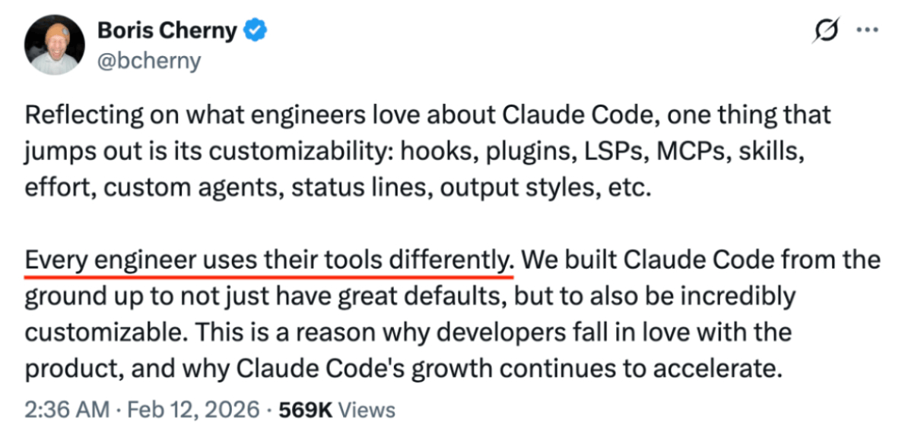
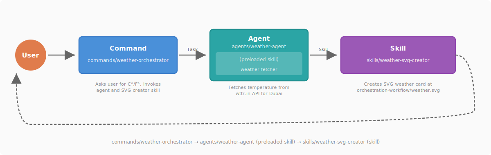

# claude-code-best-practice
practice makes claude perfect

 <a href="https://github.com/shanraisshan/claude-code-best-practice/stargazers"></a>

[](best-practice/) *Click on this badge to show the latest best practice*<br>
[](implementation/) *Click on this badge to show implementation in this repo*<br>
[](orchestration-workflow/orchestration-workflow.md) *Click on this badge to see the Command → Agent → Skill orchestration workflow*

<p align="center">
  
</p>

<p align="center">
  <br>
  Boris Cherny on X (<a href="https://x.com/bcherny/status/2007179832300581177">tweet 1</a> · <a href="https://x.com/bcherny/status/2017742741636321619">tweet 2</a> · <a href="https://x.com/bcherny/status/2021699851499798911">tweet 3</a>)
</p>


## CONCEPTS

| Feature | Location | Description |
|---------|----------|-------------|
| [**Commands**](https://code.claude.com/docs/en/skills) | `.claude/commands/<name>.md` | [](best-practice/claude-commands.md) [](implementation/claude-commands-implementation.md) Entry-point prompts for workflows — invoke with `/command-name` |
| [**Sub-Agents**](https://code.claude.com/docs/en/sub-agents) | `.claude/agents/<name>.md` | [](best-practice/claude-subagents.md) [](implementation/claude-subagents-implementation.md) Custom agents with their own name, color, tools, permissions, and model |
| [**Skills**](https://code.claude.com/docs/en/skills) | `.claude/skills/<name>/SKILL.md` | [](best-practice/claude-skills.md) [](implementation/claude-skills-implementation.md) Reusable knowledge, workflows, and slash commands — load on-demand or invoke with `/skill-name` |
| [**Workflows**](https://code.claude.com/docs/en/common-workflows) | [`.claude/commands/weather-orchestrator.md`](.claude/commands/weather-orchestrator.md) | [](orchestration-workflow/orchestration-workflow.md) |
| [**Hooks**](https://code.claude.com/docs/en/hooks) | `.claude/hooks/` | [](https://github.com/shanraisshan/claude-code-voice-hooks) [](https://github.com/shanraisshan/claude-code-voice-hooks) Deterministic scripts that run outside the agentic loop on specific events |
| [**MCP Servers**](https://code.claude.com/docs/en/mcp) | `.claude/settings.json`, `.mcp.json` | [](best-practice/claude-mcp.md) [](.mcp.json) Model Context Protocol connections to external tools, databases, and APIs |
| [**Plugins**](https://code.claude.com/docs/en/plugins) | distributable packages | Bundles of skills, subagents, hooks, and MCP servers · [Marketplaces](https://code.claude.com/docs/en/discover-plugins) |
| [**Settings**](https://code.claude.com/docs/en/settings) | `.claude/settings.json` | [](best-practice/claude-settings.md) [](.claude/settings.json) Hierarchical configuration system · [Permissions](https://code.claude.com/docs/en/permissions) · [Model Config](https://code.claude.com/docs/en/model-config) · [Output Styles](https://code.claude.com/docs/en/output-styles) · [Sandboxing](https://code.claude.com/docs/en/sandboxing) · [Keybindings](https://code.claude.com/docs/en/keybindings) · [Fast Mode](https://code.claude.com/docs/en/fast-mode) |
| [**Status Line**](https://code.claude.com/docs/en/statusline) | `.claude/settings.json` | [](https://github.com/shanraisshan/claude-code-status-line) [](.claude/settings.json) Customizable status bar showing context usage, model, cost, and session info |
| [**Memory**](https://code.claude.com/docs/en/memory) | `CLAUDE.md`, `.claude/rules/`, `~/.claude/rules/`, `~/.claude/projects/<project>/memory/` | [](best-practice/claude-memory.md) [](CLAUDE.md) Persistent context via CLAUDE.md files and `@path` imports · [Auto Memory](https://code.claude.com/docs/en/memory) · [Rules](https://code.claude.com/docs/en/memory#organize-rules-with-clauderules) |
| [**Checkpointing**](https://code.claude.com/docs/en/checkpointing) | automatic (git-based) | Automatic tracking of file edits with rewind (`Esc Esc` or `/rewind`) and targeted summarization |
| [**CLI Startup Flags**](https://code.claude.com/docs/en/cli-reference) | `claude [flags]` | [](best-practice/claude-cli-startup-flags.md) Command-line flags, subcommands, and environment variables for launching Claude Code |
| **AI Terms** | | [](https://github.com/shanraisshan/claude-code-codex-cursor-gemini/blob/main/reports/ai-terms.md) Agentic Engineering · Context Engineering · Vibe Coding |
| [**Best Practices**](https://code.claude.com/docs/en/best-practices) | | Official best practices · [Prompt Engineering](https://github.com/anthropics/prompt-eng-interactive-tutorial) · [Extend Claude Code](https://code.claude.com/docs/en/features-overview) |

### 🔥 Hot

| Feature | Location | Description |
|---------|----------|-------------|
| [**Agent Teams**](https://code.claude.com/docs/en/agent-teams) | `.claude/agents/<name>.md` | Multiple agents working in parallel on the same codebase with shared task coordination |
| [**Voice Mode**](https://x.com/trq212/status/2028628570692890800) | built-in command | speak to prompt - /voice to activate|
| [**Remote Control**](https://code.claude.com/docs/en/remote-control) | built-in command | Continue local sessions from any device — phone, tablet, or browser · [Headless Mode](https://code.claude.com/docs/en/headless) |
| [**Git Worktrees**](https://code.claude.com/docs/en/common-workflows) | built-in | [](https://x.com/bcherny/status/2025007393290272904) Isolated git branches for parallel development — each agent gets its own working copy |
| [**Ralph Wiggum Loop**](https://github.com/anthropics/claude-code/tree/main/plugins/ralph-wiggum) | plugin | [](https://github.com/ghuntley/how-to-ralph-wiggum) [](https://github.com/shanraisshan/novel-llm-26) Autonomous development loop for long-running tasks — iterates until completion |

<a id="orchestration-workflow"></a>

## <a href="orchestration-workflow/orchestration-workflow.md"></a>

See [orchestration-workflow](orchestration-workflow/orchestration-workflow.md) for implementation details of **Command → Agent → Skill** pattern.


<p align="center">
  
</p>

<p align="center">
  
</p>


```bash
claude
/weather-orchestrator
```

| Component | Role | Example |
|-----------|------|---------|
| **Command** | Entry point, user interaction | [`/weather-orchestrator`](.claude/commands/weather-orchestrator.md) |
| **Agent** | Fetches data with preloaded skill (agent skill) | [`weather-agent`](.claude/agents/weather-agent.md) with [`weather-fetcher`](.claude/skills/weather-fetcher/SKILL.md) |
| **Skill** | Creates output independently (skill) | [`weather-svg-creator`](.claude/skills/weather-svg-creator/SKILL.md) |

## DEVELOPMENT WORKFLOWS

### 🔥 Hot
- [Cross-Model (Claude Code + Codex) Workflow](development-workflows/cross-model-workflow/cross-model-workflow.md) [](development-workflows/cross-model-workflow/cross-model-workflow.md)
- [RPI](development-workflows/rpi/rpi-workflow.md) [](development-workflows/rpi/rpi-workflow.md)
- [Ralph Wiggum Loop](https://www.youtube.com/watch?v=eAtvoGlpeRU) [](https://github.com/shanraisshan/novel-llm-26)

### Others
- [Github Speckit](https://github.com/github/spec-kit) · ★ 74k
- [obra/superpowers](https://github.com/obra/superpowers) · ★ 72k
- [OpenSpec OPSX](https://github.com/Fission-AI/OpenSpec/blob/main/docs/opsx.md) · ★ 28k
- [get-shit-done (GSD)](https://github.com/gsd-build/get-shit-done) · ★ 25k
- [Andrej Karpathy (Founding Member, OpenAI) Workflow](https://github.com/forrestchang/andrej-karpathy-skills) · ★ 7k
- [Brian Casel (Creator of Agent OS) - 2026 Workflow](https://github.com/buildermethods/agent-os) · ★ 4k - [it's overkill in 2026](https://www.youtube.com/watch?v=0hdFJA-ho3c)
- [Human Layer RPI - Research Plan Implement](https://github.com/humanlayer/advanced-context-engineering-for-coding-agents/blob/main/ace-fca.md) · ★ 1.5k
- [Boris Cherny (Creator of Claude Code) - Feb 2026 Workflow](https://x.com/bcherny/status/2017742741636321619)
- [Peter Steinberger (Creator of OpenClaw) Workflow](https://youtu.be/8lF7HmQ_RgY?t=2582)

## TIPS AND TRICKS


■ **Planning (2)**
- always start with [plan mode](https://code.claude.com/docs/en/common-workflows). ask Claude to interview you; [ask the user a question](https://code.claude.com/docs/en/cli-reference)
- always make a phase-wise gated plan, with each phase having multiple tests (unit, automation, integration). use [cross-model](development-workflows/cross-model-workflow/cross-model-workflow.md) to review your plan

■ **Workflows (12)**
- [CLAUDE.md](https://code.claude.com/docs/en/memory) should target under [200 lines](https://code.claude.com/docs/en/memory#write-effective-instructions) per file. [60 lines in humanlayer](https://www.humanlayer.dev/blog/writing-a-good-claude-md) ([still not 100% guaranteed](https://www.reddit.com/r/ClaudeCode/comments/1qn9pb9/claudemd_says_must_use_agent_claude_ignores_it_80/)).
- use [multiple CLAUDE.md](best-practice/claude-memory.md) for monorepos — ancestor + descendant loading
- use [.claude/rules/](https://code.claude.com/docs/en/memory#organize-rules-with-clauderules) to split large instructions
- use [commands](https://code.claude.com/docs/en/skills) for your workflows instead of [sub-agents](https://code.claude.com/docs/en/sub-agents)
- have feature specific [sub-agents](https://code.claude.com/docs/en/sub-agents) (extra context) with [skills](https://code.claude.com/docs/en/skills) (progressive disclosure) instead of general qa, backend engineer.
- [memory.md](https://code.claude.com/docs/en/memory), constitution.md does not guarantee anything
- avoid agent dumb zone, do manual [/compact](https://code.claude.com/docs/en/context-management) at max 50%. Use [/clear](https://code.claude.com/docs/en/cli-reference) to reset context mid-session if switching to a new task
- vanilla cc is better than any workflows with smaller tasks
- use [skills in subfolders](reports/claude-skills-for-larger-mono-repos.md) for monorepos
- use [/model](https://code.claude.com/docs/en/model-configuration) to select model and reasoning, [/context](https://code.claude.com/docs/en/context-management) to see context usage, [/usage](https://code.claude.com/docs/en/usage-billing) to set a weekly limit, [/config](https://code.claude.com/docs/en/settings) to configure settings
- always use [thinking mode](https://code.claude.com/docs/en/model-configuration) true (to see reasoning) and [Output Style](https://code.claude.com/docs/en/output-styles) Explanatory (to see detailed output with ★ Insight boxes) in /config for better understanding of Claude's decisions
- use ultrathink keyword in prompts for [high effort reasoning](https://docs.anthropic.com/en/docs/build-with-claude/extended-thinking#tips-and-best-practices)
- [/rename](https://code.claude.com/docs/en/cli-reference) important sessions (e.g. [TODO - refactor task]) and [/resume](https://code.claude.com/docs/en/cli-reference) them later
- use [Esc Esc or /rewind](https://code.claude.com/docs/en/checkpointing) to undo when Claude goes off-track instead of trying to fix it in the same context
- commit often — try to commit at least once per hour, as soon as task is completed, commit.

■ **Workflows Advanced (5)**
- use ASCII diagrams a lot to understand your architecture
- [agent teams with tmux](https://code.claude.com/docs/en/agent-teams) and [git worktrees](https://x.com/bcherny/status/2025007393290272904) for parallel development
- use [Ralph Wiggum plugin](https://github.com/shanraisshan/novel-llm-26) for long-running autonomous tasks
- [/permissions](https://code.claude.com/docs/en/permissions) with wildcard syntax (Bash(npm run *), Edit(/docs/**)) instead of dangerously-skip-permissions
- [/sandbox](https://code.claude.com/docs/en/sandboxing) to reduce permission prompts with file and network isolation

■ **Debugging (5)**
- make it a habit to take screenshots and share with Claude whenever you are stuck with any issue
- use mcp ([Claude in Chrome](https://code.claude.com/docs/en/chrome), [Playwright](https://github.com/microsoft/playwright-mcp), [Chrome DevTools](https://developer.chrome.com/blog/chrome-devtools-mcp)) to let claude see chrome console logs on its own
- always ask claude to run the terminal (you want to see logs of) as a background task for better debugging
- [/doctor](https://code.claude.com/docs/en/cli-reference) to diagnose installation, authentication, and configuration issues
- use a [cross-model](development-workflows/cross-model-workflow/cross-model-workflow.md) for QA — e.g. [Codex](https://github.com/shanraisshan/codex-cli-best-practice) for plan and implementation review

■ **Utilities (5)**
- [iTerm](https://iterm2.com/)/[Ghostty](https://ghostty.org/)/[tmux](https://github.com/tmux/tmux) terminals instead of IDE ([VS Code](https://code.visualstudio.com/)/[Cursor](https://www.cursor.com/))
- [Wispr Flow](https://wisprflow.ai) for voice prompting (10x productivity)
- [claude-code-voice-hooks](https://github.com/shanraisshan/claude-code-voice-hooks) for claude feedback
- [status line](https://github.com/shanraisshan/claude-code-status-line) for context awareness and fast compacting
- explore [settings.json](best-practice/claude-settings.md) features like [Plans Directory](best-practice/claude-settings.md#plans-directory), [Spinner Verbs](best-practice/claude-settings.md#display--ux) for a personalized experience

■ **Daily (3)**
- [update](https://code.claude.com/docs/en/setup) Claude Code daily and start your day by reading the [changelog](https://github.com/anthropics/claude-code/blob/main/CHANGELOG.md)
- follow [r/ClaudeAI](https://www.reddit.com/r/ClaudeAI/), [r/ClaudeCode](https://www.reddit.com/r/ClaudeCode/) on Reddit
- follow [Boris](https://x.com/bcherny), [Thariq](https://x.com/trq212), [Cat](https://x.com/_catwu), [Lydia](https://x.com/lydiahallie) on X


- [Always use plan mode, give Claude a way to verify, use /code-review | 27/Dec/25](https://x.com/bcherny/status/2004711722926616680) ● [Tweet](https://x.com/bcherny/status/2004711722926616680)
- [Ask Claude to interview you using AskUserQuestion tool (Thariq) | 28/Dec/25](https://x.com/trq212/status/2005315275026260309) ● [Tweet](https://x.com/trq212/status/2005315275026260309)
- [Boris setup - 5 tips | 03/Jan/26](https://x.com/bcherny/status/2007179832300581177) ● [Tweet](https://x.com/bcherny/status/2007179832300581177)
- [10 tips for using claude code by team itself | 01/Feb/26](https://x.com/bcherny/status/2017742741636321619) ● [Tweet](https://x.com/bcherny/status/2017742741636321619)
- [12 ways how people are customizing their claudes | 12/Feb/26](tips/claude-boris-tips-feb-26.md) ● [Tweet](https://x.com/bcherny/status/2021699851499798911)
- [Git Worktrees - 5 ways how boris is using | 21 Feb 2026](https://x.com/bcherny/status/2025007393290272904) ● [Tweet](https://x.com/bcherny/status/2025007393290272904)
- [Seeing like an Agent - lessons from building Claude Code (Thariq) | 28 Feb 2026](https://x.com/trq212/status/2027463795355095314) ● [Tweet](https://x.com/trq212/status/2027463795355095314)

## ☠️ STARTUPS / BUSINESSES

| Claude | Replaced |
|-|-|
|[**Voice Mode**](https://x.com/trq212/status/2028628570692890800)|[Wispr Flow](https://wisprflow.ai), [SuperWhisper](https://superwhisper.com/)|
|[**Remote Control**](https://code.claude.com/docs/en/remote-control)|[OpenClaw](https://openclaw.ai/)
|[**Cowork**](https://code.claude.com/docs/en/cowork)|[OpenAI Operator](https://openai.com/operator), [AgentShadow](https://agentshadow.ai)
|[**Tasks**](https://x.com/trq212/status/2014480496013803643)|[Beads](https://github.com/steveyegge/beads)
|[**Plan Mode**](https://code.claude.com/docs/en/common-workflows)|[Agent OS](https://github.com/buildermethods/agent-os)|
|[**Skills / Plugins**](https://code.claude.com/docs/en/plugins)|YC AI wrapper startups ([reddit](https://reddit.com/r/ClaudeAI/comments/1r6bh4d/claude_code_skills_are_basically_yc_ai_startup/))|

<a id="billion-dollar-questions"></a>


*If you have answers, do let me know at shanraisshan@gmail.com*

**Memory & Instructions (4)**

1. What exactly should you put inside your CLAUDE.md — and what should you leave out?
2. If you already have a CLAUDE.md, is a separate constitution.md or rules.md actually needed?
3. How often should you update your CLAUDE.md, and how do you know when it's become stale?
4. Why does Claude still ignore CLAUDE.md instructions — even when they say MUST in all caps? ([reddit](https://reddit.com/r/ClaudeCode/comments/1qn9pb9/claudemd_says_must_use_agent_claude_ignores_it_80/))

**Agents, Skills & Workflows (3)**

1. When should you use a command vs an agent vs a skill — and when is vanilla Claude Code just better?
2. How often should you update your agents, commands, and workflows as models improve?
3. Does giving your subagent a detailed persona improve quality? What does a "perfect persona/prompt" for research/QA subagent look like?

**Specs & Documentation (3)**

1. Should every feature in your repo have a spec as a markdown file?
2. How often do you need to update specs so they don't become obsolete when a new feature is implemented?
3. When implementing a new feature, how do you handle the ripple effect on specs for other features?

## REPORTS

| Report | Description |
|--------|-------------|
| [Agent SDK vs CLI System Prompts](reports/claude-agent-sdk-vs-cli-system-prompts.md) | Why Claude CLI and Agent SDK outputs may differ—system prompt architecture and determinism |
| [Browser Automation MCP Comparison](reports/claude-in-chrome-v-chrome-devtools-mcp.md) | Comparison of Playwright, Chrome DevTools, and Claude in Chrome for automated testing |
| [Global vs Project Settings](reports/claude-global-vs-project-settings.md) | Which features are global-only (`~/.claude/`) vs dual-scope, including Tasks and Agent Teams |
| [Skills Discovery in Monorepos](reports/claude-skills-for-larger-mono-repos.md) | How skills are discovered and loaded in large monorepo projects |
| [Agent Memory Frontmatter](reports/claude-agent-memory.md) | Persistent memory scopes (`user`, `project`, `local`) for subagents — enabling agents to learn across sessions |
| [Advanced Tool Use Patterns](reports/claude-advanced-tool-use.md) | Programmatic Tool Calling (PTC), Tool Search, and Tool Use Examples |
| [Usage, Rate Limits & Extra Usage](reports/claude-usage-and-rate-limits.md) | Usage commands (`/usage`, `/extra-usage`, `/cost`), rate limits, and pay-as-you-go overflow billing |
| [LLM Day-to-Day Degradation](reports/llm-day-to-day-degradation.md) | Why LLM performance varies day-to-day — infrastructure bugs, MoE routing variance, and psychology |

[](https://claude.com/contact-sales/claude-for-oss)
